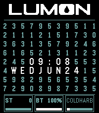
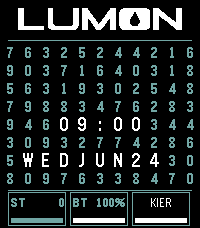
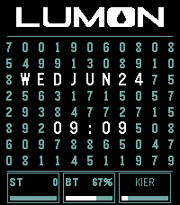
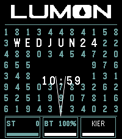

# LumonTime — A Severance-Inspired Pebble Watchface

A Pebble Time 2 watchface styled after **Lumon Industries** from the TV series *Severance*. It recreates the Macrodata Refinement terminal look: a wall of numbers, live time and date woven into the grid, and receiving bins that collect your stats.

**[Download on the Pebble App Store](https://apps.repebble.com/87e9be27ecf34f248efa8235)**

## What You See

### The MDR Terminal

- **Lumon logo** at the top, drawn from the official lumon.industries typeface
- **Number grid** filling the screen — digits shift each minute like the show's refinement terminals
- **Time and date** appear inside the grid in larger type, centered, on different rows that change every minute (e.g. `12:34` and `WEDJUN24`)
- **Cyan-on-dark palette** matching the Lumon intranet aesthetic

### Receiving Bins

Three bins along the bottom — the trays where "refined" data lands in the show. Each shows a value and a fill bar.

| Bin | Shows | Bar |
| --- | --- | --- |
| **ST** | Today's step count | Progress toward 10,000 steps |
| **BT** | Battery percentage | Current charge level |
| **File** | Active MDR file name | Progress through the current hour |

The file name rotates through locations from the show — Tumwater, Cairns, Siena, Allentown, Wellington, Pacifica, Bellefonte, Nantucket, Cold Harbor. At the top of each hour it reads **KIER**.

### Collection Animation

When the time or date changes, the old digits break free from the grid and fly down into a bin, with funnel lines guiding them — just like data collection in MDR.

You can choose how often this plays:

- **Hourly** (default) — when the hour changes; date also animates at midnight
- **Every minute** — on any time or date change
- **Off** — static grid, no animation

A short demo runs once when the watchface first loads (unless animation is Off). Change the setting from the watchface's settings page in the Pebble phone app.

## Screenshots

| | |
| --- | --- |
|  | The MDR grid with live time, date, and receiving bins |
|  | Top of the hour — the file bin shows **KIER** with a full bar |
|  | Time and date on separate grid rows; file name and battery in the bins |
|  | Digits collect into a bin when the time changes |

## Building & Installing

For developers with the [Pebble SDK](https://developer.rebble.io/) installed. Targets **Pebble Time 2**.

```bash
pebble build
pebble install --emulator emery   # emulator
pebble install                    # connected watch
```

Contributor tooling (`npm run outline`, `npm run lint:ast`) is documented in `AGENTS.md`.

## Inspiration

Inspired by the **Lumon Industries MDR terminal** from *Severance* — the mysterious Macrodata Refinement department where employees sort numbers on grid-based screens without knowing what the data means.

## Resources

- [Severance Wiki — Typography](https://www.severance.wiki/typography)
- [Lumon Industries Intranet](https://lumon.industries/intranet/terminal/)
- [Pebble SDK Documentation](https://developer.rebble.io/)

## License

Fan project inspired by *Severance*. Use and modify freely for personal use.

---

**Status:** Production-ready for Pebble Time 2. Currently in active use.
